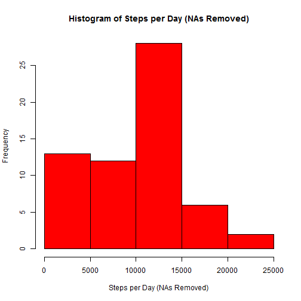
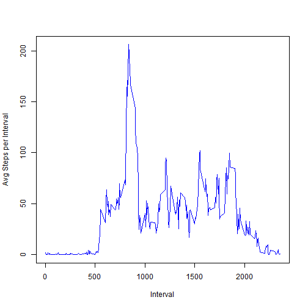
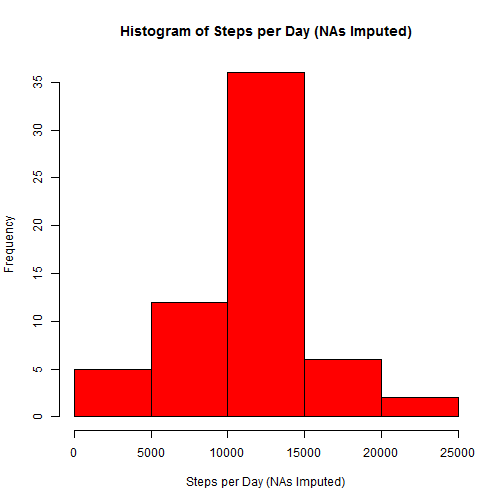
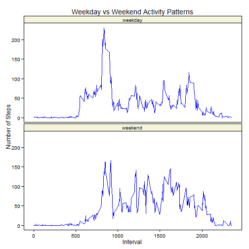

## Loading and preprocessing the data
- Download the raw activty data:

```r
    activity_zip_file <- "activity.zip"
    source_url <- "https://d396qusza40orc.cloudfront.net/repdata%2Fdata%2Factivity.zip"
    download_time <- format(Sys.time(), "%a %b %d %X %Y")
    download.file(url = source_url, destfile = activity_zip_file, mode = "wb")
```
Downloaded activity data downloaded from url https://d396qusza40orc.cloudfront.net/repdata%2Fdata%2Factivity.zip on Fri Nov 14 8:28:34 PM 2014

- Expand the zip file:

```r
    activity_csv_file <- "activity.csv"
    unzip(activity_zip_file, exdir = ".")
```

- Read the activity data file into a data frame:

```r
    activity_data <- read.csv(activity_csv_file, na.strings=("NA"))
```

## What is mean total number of steps taken per day?

```r
    library(dplyr, quietly = TRUE)
    ## calculations removing NAs

    ## group by date and add all steps for one day together
    step_sum_data <- activity_data %>% group_by(date) %>% dplyr::summarise(stepsperday=sum(steps, na.rm=TRUE))

    ## create histogram of total steps per day
    hist(step_sum_data$stepsperday, main = "Histogram of Steps per Day (NAs Removed)", xlab = "Steps per Day (NAs Removed)", col = "red")
```

 

```r
    ## calculate the median and mean number of steps with NA removed
    mean_steps_per_day_na_removed <- as.integer(mean(step_sum_data$stepsperday, na.rm = TRUE))
    median_steps_per_day_na_removed <- as.integer(median(step_sum_data$stepsperday, na.rm = TRUE))
```

**Steps per day(mean - NAs removed) = 9354** 

**Steps per day(median - NAs removed) = 10395** 

## What is the average daily activity pattern?


```r
   ## calculate with NAs removed
   ## group by time of day and take the average number of steps
   daily_avg_data <- activity_data %>% group_by(interval) %>% dplyr::summarise(avgstepsperinterval=mean(steps, na.rm=TRUE))

   ## time series plot of average steps at a particular time
   with(daily_avg_data,
        plot(x=interval, y=avgstepsperinterval, xlab="Interval", ylab="Avg Steps per Interval", type="l", col="blue"))
```

 

```r
   ## get interval with maximum average steps with NAs Removed
   maximum_avg_step_interval <- daily_avg_data[daily_avg_data$avgstepsperinterval == max(daily_avg_data$avgstepsperinterval), ]
```

**Interval with maximum average number of steps (NAs removed) = 835**

**Maximum average number of steps (NAs removed) = 206.1698**

## Imputing missing values
- Find the number of NA values in the original data set

```r
na_sum <- sum(is.na( activity_data ))
```

**Number of NA values in the original data set = 2304**
- Impute missing number of steps.  If the number of steps is missing substitute the average number of steps for that interval


```r
    ## make a copy of the steps from the original data
    imputed_steps <- activity_data$steps

    ## fill in the missing step values
    for(i in 1:length(imputed_steps)) {
        if (is.na(imputed_steps[i])) {
            # if steps is missing
            # use the average daily steps for this interval calculated above
            imputed_steps[i] = as.integer(daily_avg_data$avgstepsperinterval[daily_avg_data$interval == activity_data$interval[i] ])
        }
    }
   
    ## create a data frame with imputed steps, date and interval
    imputed_activity_data <- data.frame(steps=imputed_steps, date=activity_data$date, interval=activity_data$interval)

    ## get total number of steps per day
    imputed_step_sum_data <- imputed_activity_data %>% group_by(date) %>% dplyr::summarise(stepsperday=sum(steps))

    ## create another histogram similar to the first but there should be no NAs
    hist(imputed_step_sum_data$stepsperday, main = "Histogram of Steps per Day (NAs Imputed)", xlab = "Steps per Day (NAs Imputed)", col = "red")
```

 

```r
    ## calculate the mean and median steps per day with imputed data
    mean_steps_per_day_na_imputed <- as.integer(mean(imputed_step_sum_data$stepsperday))
    median_steps_per_day_na_imputed <- as.integer(median(imputed_step_sum_data$stepsperday))
```

**Steps per day(mean - NAs imputed) = 10749** 

**Steps per day(median - NAs imputed) = 10641** 

- What is the impact of imputing the missing step data?


```r
   ## compare the median and mean of the data set with NAs removed to imputed data set
   mean_impact <- ifelse(mean_steps_per_day_na_imputed > mean_steps_per_day_na_removed, "greater", "less")
   mean_difference <- abs(mean_steps_per_day_na_imputed - mean_steps_per_day_na_removed)
   median_impact <- ifelse(median_steps_per_day_na_imputed > median_steps_per_day_na_removed, "greater", "less")
   median_difference <- abs(median_steps_per_day_na_imputed - median_steps_per_day_na_removed)
```

Imputed mean steps per day are greater than mean steps per day with NAs removed.
Difference between means = 1395.
Imputed median steps per day are greater than median steps per day with NAs removed.
Difference between medians = 246.


## Are there differences in activity patterns between weekdays and weekends?

```r
    library(ggplot2, quietly = TRUE)

    ## classify the days as weekdays(Mon - Fri) and weekends(Sat and Sun)
    imputed_activity_data <- mutate(imputed_activity_data, dayclassification=ifelse((weekdays(ymd(date)) == "Saturday" | weekdays(ymd(date)) == "Sunday"), "weekend", "weekday"))

    ## calculate mean steps per interval, separate by weekend/weekday
    avg_activity_per_day <- imputed_activity_data %>% group_by(interval, dayclassification) %>% dplyr::summarise(stepsperday=mean(steps))

    ## panel plot for weekday and weekend activity using imputed data
    p <- qplot(x = interval, y = stepsperday, data=avg_activity_per_day, geom="line") + 
         ## fix the formatting, black borders, axis colors, line colors, etc
         theme(panel.grid.major = element_blank(), panel.grid.minor = element_blank(), 
               panel.background = element_blank(), panel.border = element_rect(fill = NA, colour="black"), 
               strip.background = element_rect(fill ="beige", colour="black"), 
               axis.ticks = element_line(colour="black"), axis.line = element_line(colour="black"), axis.text = element_text(colour = "black")) + 
         geom_line(colour="blue") +
    
         ## divide into graphs by weekend/weekday
         facet_wrap(~ dayclassification, ncol=1) +
    
         ## set the labels
         xlab("Interval") + ylab("Number of Steps") +
         ggtitle("Weekday vs Weekend Activity Patterns") 
    print(p)
```

 
